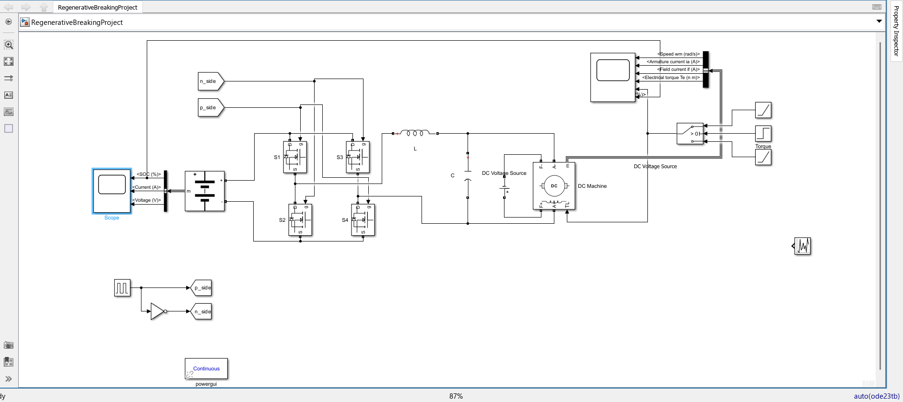
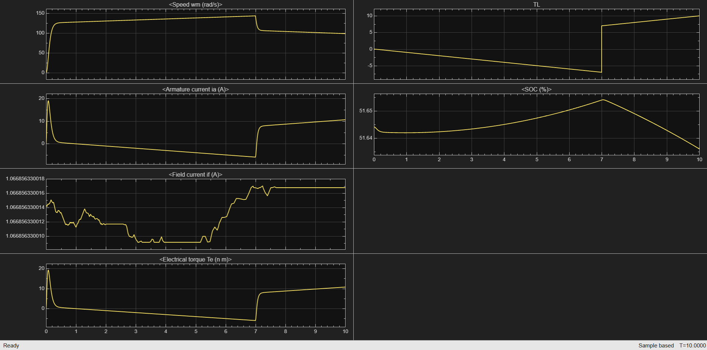

# EV Regenerative Braking System: Bi-Directional H-Bridge Converter

## Overview
This project features a designed and simulated bi-directional H-bridge DC-DC converter aimed at managing power flow between a battery system and a separately excited DC traction motor. It demonstrates the mechanics of regenerative braking in electric vehicles by recovering kinetic energy and feeding it back into the battery system.

## Key Features
* **Bi-Directional Power Flow:** Seamlessly manages energy transfer between the battery and the DC machine.
* **Complementary PWM Control:** Implements precision control logic to enable two-quadrant operation (motoring and generating).
* **Kinetic Energy Recovery:** Utilizes freewheeling diodes for boost-converter action during braking phases, returning power to the source.
* **Real-Time Transient Analysis:** Validates regenerative capabilities through comprehensive data scopes tracking State of Charge (SOC), armature current, and electrical torque.

## Tech Stack
* **MATLAB / Simulink:** Used for system modeling, control logic implementation, and scope visualization.
* **Simscape Electrical:** Utilized for modeling the DC machine, H-bridge components, and battery source.

## Simulation Model
The Simulink model integrates a battery module, the H-bridge converter (using four MOSFETs/IGBTs), LC filtering, and a separately excited DC motor. The control logic relies on a complementary PWM generator to drive the switching components based on the required operation quadrant.

<figure>
  
  <figcaption><em>Figure 1: Complete system architecture in Simulink.</em></figcaption>
</figure>

## Results & Analysis
The simulation was validated by analyzing real-time data scopes during motoring and braking cycles. Key observations include:
* **Speed (rad/s):** Demonstrates expected acceleration and deceleration profiles.
* **Armature Current (A) & Electrical Torque (N-m):** Reverses direction during the braking phase, indicating a shift from motoring to generating.
* **State of Charge (SOC %):** The battery SOC noticeably increases during the regenerative braking cycle, proving successful energy recovery.

<figure>
  
  <figcaption><em>Figure 2: Scope outputs displaying Speed, Armature Current, Field Current, Electrical Torque, Load Torque and SOC.</em></figcaption>
</figure>

## How to Run
1. Clone the repository to your local machine.
2. Open MATLAB and navigate to the repository folder.
3. Open the `.slx` simulation file.
4. Run the simulation and open the Scope blocks to observe the transients in real time.
